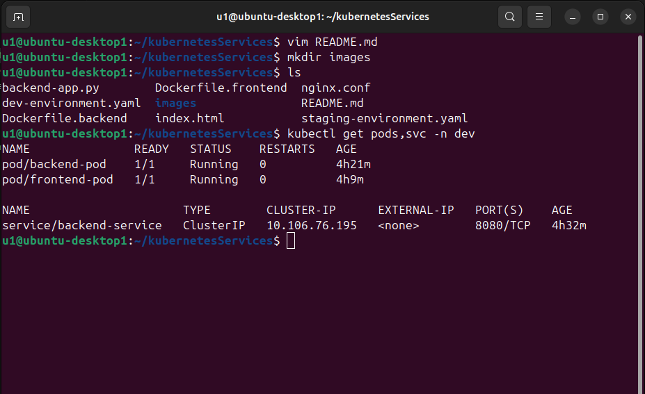
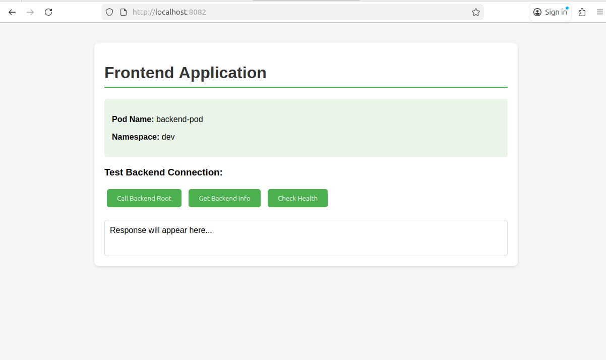
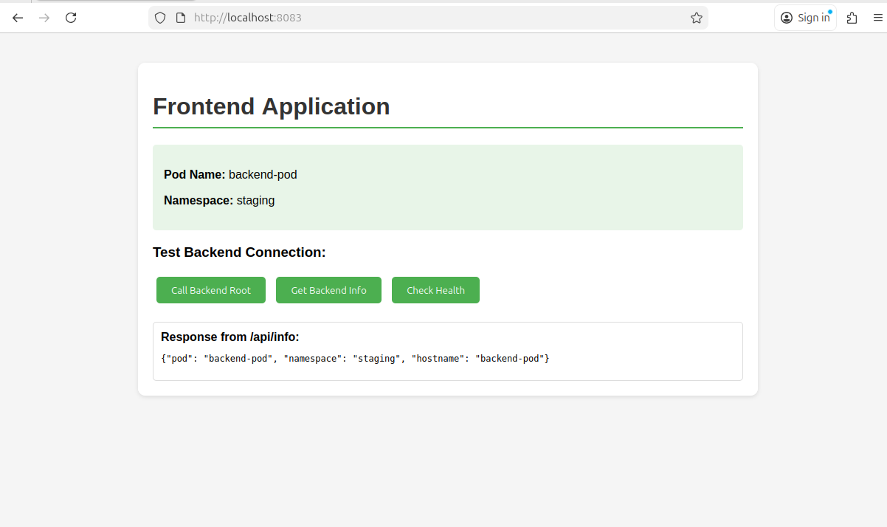

# Lab 3: Multi-Tenancy with Namespaces and Internal Routing

## Overview

This lab demonstrates how to run **multiple isolated environments** inside a single Kubernetes cluster using **Namespaces** and how to enable **internal communication** between application components using a **ClusterIP Service**.

In this project, the same two-tier application is deployed in two separate environments:

* **dev**
* **staging**

Each environment contains:

* a **backend pod**
* a **frontend pod**
* a **backend service** for internal routing

The frontend communicates with the backend using the service name `backend-service`, which proves that applications can communicate internally within the same namespace while remaining isolated from other namespaces.

---

## Architecture

```text
                         +-----------------------------+
                         |       Kubernetes Cluster    |
                         +-----------------------------+
                            |                       |
                            |                       |
                +---------------------+   +----------------------+
                |    Namespace: dev   |   | Namespace: staging   |
                +---------------------+   +----------------------+
                | frontend-pod        |   | frontend-pod         |
                |        |            |   |        |             |
                |        v            |   |        v             |
                | backend-service     |   | backend-service      |
                |        |            |   |        |             |
                |        v            |   |        v             |
                | backend-pod         |   | backend-pod          |
                +---------------------+   +----------------------+
```

---

## Objectives

* Create two namespaces: `dev` and `staging`
* Deploy the same application stack into both namespaces
* Expose the backend internally using a `ClusterIP` service
* Configure the frontend to communicate with the backend through the service name
* Demonstrate namespace-based environment isolation
* Verify the application using `kubectl` commands and browser access through `port-forward`

---

## Project Structure

```text
.
├── Dockerfile.backend
├── Dockerfile.frontend
├── backend-app.py
├── index.html
├── nginx.conf
├── dev-environment.yaml
├── staging-environment.yaml
└── README.md
```

---

## Application Components

### Backend

The backend is a simple Python HTTP server that runs on port `8080` and provides the following endpoints:

* `/` → backend root page
* `/health` → health check endpoint
* `/info` → returns pod and namespace information in JSON format

### Frontend

The frontend is served by **Nginx** and acts as a UI layer for testing communication with the backend. It proxies requests to the backend service using internal DNS.

---

## Technologies Used

* Kubernetes
* Minikube
* Docker
* Python 3
* Nginx

---

## Docker Image Build

Build the backend image:

```bash
docker build -f Dockerfile.backend -t backend-app:latest .
```

Build the frontend image:

```bash
docker build -f Dockerfile.frontend -t frontend-app:latest .
```

If using Minikube, load the images:

```bash
minikube image load backend-app:latest
minikube image load frontend-app:latest
```

---

## Namespace Creation

Create the required namespaces:

```bash
kubectl create namespace dev
kubectl create namespace staging
```

Verify:

```bash
kubectl get namespaces
```

---

## Deployment Files

### dev-environment.yaml

Contains:

* `backend-pod` in namespace `dev`
* `backend-service` in namespace `dev`
* `frontend-pod` in namespace `dev`

### staging-environment.yaml

Contains:

* `backend-pod` in namespace `staging`
* `backend-service` in namespace `staging`
* `frontend-pod` in namespace `staging`

Both backend pods receive these environment variables from Kubernetes:

* `POD_NAME`
* `NAMESPACE`

This allows the backend to display which pod and namespace it belongs to.

---

## Deployment Steps

Apply the manifests:

```bash
kubectl apply -f dev-environment.yaml
kubectl apply -f staging-environment.yaml
```

Verify resources in `dev`:

```bash
kubectl get pods,svc -n dev
```

Verify resources in `staging`:

```bash
kubectl get pods,svc -n staging
```

---

## Internal Routing Explanation

The frontend communicates with the backend using the Kubernetes service name:

```text
backend-service
```

Because service discovery is namespace-aware in Kubernetes:

* the frontend in `dev` reaches `backend-service` in `dev`
* the frontend in `staging` reaches `backend-service` in `staging`

This demonstrates **environment isolation** inside one shared cluster.

---

## Nginx Routing

The Nginx configuration proxies requests as follows:

* `/api` → backend root `/`
* `/api/info` → backend `/info`
* `/api/health` → backend `/health`

This allows the frontend UI to test backend connectivity through internal service routing.

---

## Accessing the Application Locally

### Dev environment

```bash
kubectl port-forward pod/frontend-pod 8082:80 -n dev
```

Open in browser:

```text
http://localhost:8082
```
### Staging environment

```bash
kubectl port-forward pod/frontend-pod 8083:80 -n staging
```

Open in browser:

```text
http://localhost:8083
```
> Note: `port-forward` is temporary and must remain running in the terminal while using the browser.

---

## Verification Commands

Check dev resources:

```bash
kubectl get pods,svc -n dev
```

Check staging resources:

```bash
kubectl get pods,svc -n staging
```

Describe a pod for troubleshooting:

```bash
kubectl describe pod backend-pod -n dev
```

Check backend logs:

```bash
kubectl logs backend-pod -n dev
```

Check environment variables inside backend pod:

```bash
kubectl exec -it backend-pod -n dev -- env | grep -E 'POD_NAME|NAMESPACE'
```

---

## Expected Results

### Dev namespace

* `backend-pod` is running
* `frontend-pod` is running
* `backend-service` exists as `ClusterIP`
* Frontend displays namespace as `dev`

### Staging namespace

* `backend-pod` is running
* `frontend-pod` is running
* `backend-service` exists as `ClusterIP`
* Frontend displays namespace as `staging`

---

## Sample Output

### `kubectl get pods,svc -n dev`

```text
NAME               READY   STATUS    RESTARTS   AGE
pod/backend-pod    1/1     Running   0          1m
pod/frontend-pod   1/1     Running   0          1m

NAME                      TYPE        CLUSTER-IP      EXTERNAL-IP   PORT(S)    AGE
service/backend-service   ClusterIP   10.96.x.x       <none>        8080/TCP   1m
```

### `kubectl get pods,svc -n staging`

```text
NAME               READY   STATUS    RESTARTS   AGE
pod/backend-pod    1/1     Running   0          1m
pod/frontend-pod   1/1     Running   0          1m

NAME                      TYPE        CLUSTER-IP      EXTERNAL-IP   PORT(S)    AGE
service/backend-service   ClusterIP   10.96.x.x       <none>        8080/TCP   1m
```

### Frontend UI example

```text
Pod Name: backend-pod
Namespace: dev
```

---

## Screenshots

### 1. Dev namespace resources



### 2. Staging namespace resources

!

### 3. Frontend in dev via port-forward



### 4. Frontend in staging via port-forward



---

## Troubleshooting Notes

### Problem: namespace appeared as `unknown`

Cause:
The backend application reads the namespace from the environment variable:

```python
os.environ.get('NAMESPACE', 'unknown')
```

Fix:
The Kubernetes manifest must pass `NAMESPACE`, not `POD_NAMESPACE`.

### Problem: `/api` returned `Not Found`

Cause:
The backend does not expose `/api`; it only exposes `/`, `/info`, and `/health`.

Fix:
Update `nginx.conf` so `/api` is proxied to `/` on the backend.

---

## Learning Outcomes

By completing this lab, I learned how to:

* use namespaces to isolate environments in Kubernetes
* deploy the same application stack to multiple namespaces
* expose backend services internally with `ClusterIP`
* route frontend traffic to backend services using internal DNS
* pass pod metadata into containers using environment variables
* test applications locally using `kubectl port-forward`
* troubleshoot configuration mismatches between code and Kubernetes manifests

---

## Conclusion

This lab successfully demonstrates how a single Kubernetes cluster can host multiple isolated environments using namespaces. The frontend and backend communicate internally through services, while each namespace remains logically separated. This setup reflects a real-world approach to managing **development** and **staging** environments efficiently inside one cluster.

---

## Author

**Name:** Your Name Here
**Course / Lab:** Kubernetes Lab 3 - Multi-Tenancy with Namespaces and Internal Routing

